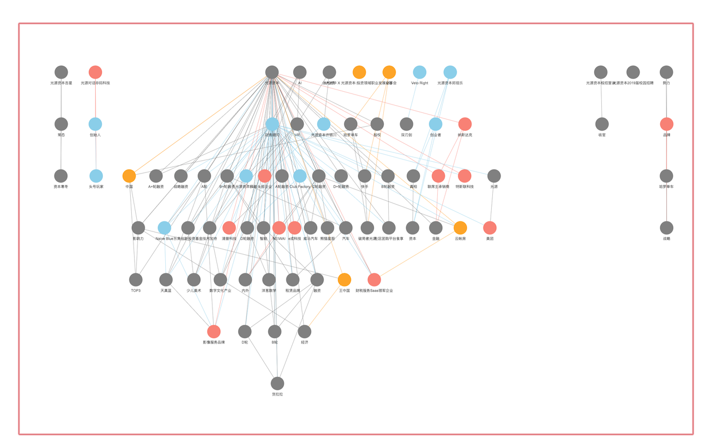
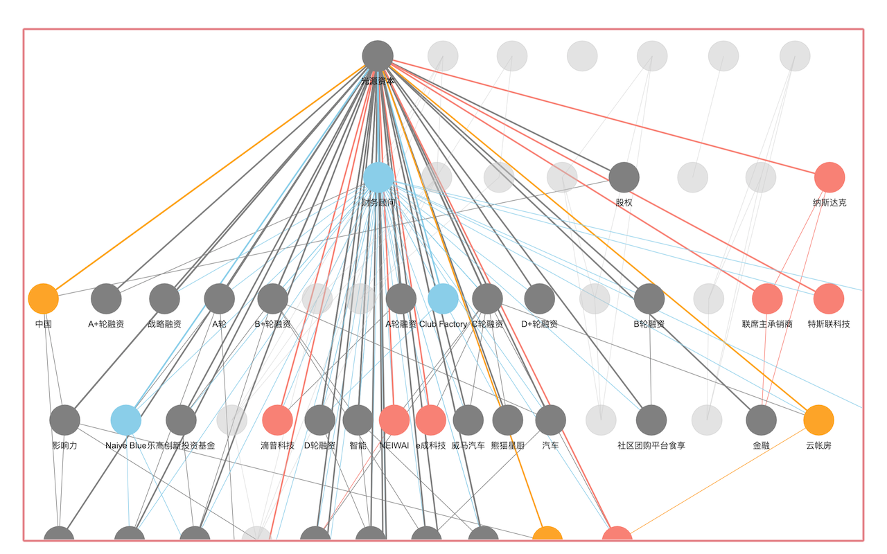

# 知识图谱 Demo

## 定义

2012年，谷歌开始使用名为 "知识图谱" 的技术增强搜索引擎，此后知识图谱一词开始流行。目前，`知识图谱` 还没有明确定义，不过人们通常用它来表示 [客观事物之间的关系](https://en.wikipedia.org/wiki/Ontology_(information_science))。在某些场景下，知识图谱也被用来表示 **任何以图的形式呈现的知识**。

[这个网址](https://medium.com/@sderymail/challenges-of-knowledge-graph-part-1-d9ffe9e35214)很好地介绍了知识图谱。

## 有关这个代码仓

本代码仓演示了如何使用公开数据制作简易知识图谱。具体来说，我们根据我们的兴趣（或问题）点找到相关的公开文章，根据这些文章的内容完成[实体](https://en.wikipedia.org/wiki/Entity_class)分析，从而达到将信息组织成[知识](https://en.wikipedia.org/wiki/Knowledge) (或理解)的目的。

代码的主旨如下，

1. 找到一个信息源
2. 从信息源中抽取数据
3. 进行实体分析
4. 绘制网络

## 配置

从 [config](https://cran.r-project.org/web/packages/config/index.html) 获取配置(`config.yml`)，其中含有样例文件。

## 例子

我们使用从 [知乎](https://www.zhihu.com/) 提取的数据，知乎是一个中国的信息分享和文章发布平台。下面的展示的是搜索 **光源资本 (Lighthouse Capital)** 的结果

## 引用

图片来自 https://medium.com/@sderymail/challenges-of-knowledge-graph-part-1-d9ffe9e35214
